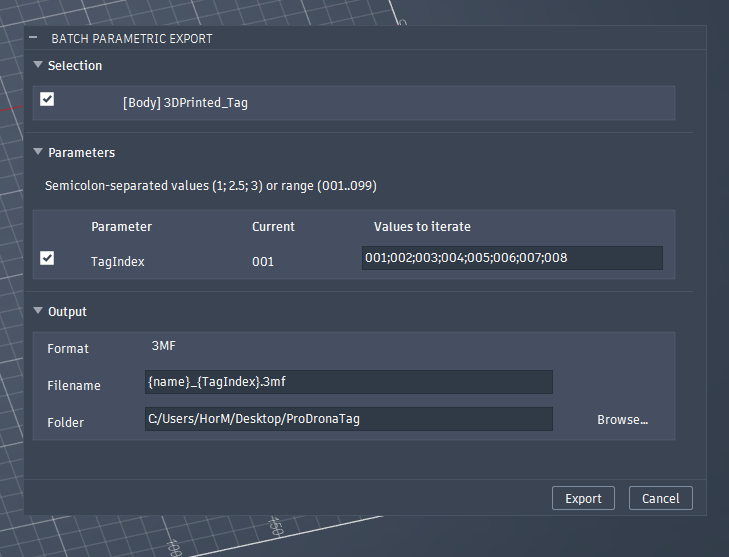

# Batch Parametric Export — Fusion Add-In

Batch-export bodies and components across every combination of selected user parameters. Numeric and text parameters, range syntax, mesh formats + STEP, per-design settings persistence.

Useful for dynamic 3D prints (my use case was making dynamic 3D printed tags).



## Install

1. Copy this folder to the Fusion Add-Ins location:
   - Windows: `%APPDATA%\Autodesk\Autodesk Fusion 360\API\AddIns\BatchParametricExport\`
   - macOS:   `~/Library/Application Support/Autodesk/Autodesk Fusion 360/API/AddIns/BatchParametricExport/`
2. In Fusion: `Utilities → ADD-INS → Scripts and Add-Ins → Add-Ins` tab, find **Batch parametric export**, click **Run**. Tick **Run on Startup** to auto-load.
3. Alternatively: click the `+` next to *My Add-Ins* and point Fusion at this folder anywhere on disk.

Once running, a **Batch parametric export** button appears in the Design workspace under the **Utility** panel.

## Usage

- Select bodies and/or components to export.
- Tick parameters to iterate. Each row has a values field:
  - **Numeric:** `1; 5.5; 12` — semicolon-separated. Leading zeros are preserved: `001; 042; 100` writes `..._001...`, `..._042...`, `..._100...`.
  - **Text** (Fusion text parameters): `001; 002; 003` — no quotes needed.
  - **Range:** `001..099` expands to `001, 002, ..., 099` with zero-padding inferred from the widest end. `1..5`, `-2..2`, and descending `005..001` all work.
- Pick output format (STEP / STL / 3MF / OBJ).
- Filename template auto-generates from `{name}` + selected params; edit it if you want. Per-parameter placeholders use `{paramName}`.
- Pick output folder. Click **Export**.

Settings (selection, values, format, template, output folder) are saved to the design's attributes and reloaded next time you open the dialog on that file.

## Supported parameters

- Non-formula numeric parameters (e.g. `2 mm`, `42`).
- Text parameters (Fusion 360 ≥ 2.0.21XXX).
- Formula parameters (`19/param3*3.14`) are not iterated — they update automatically when their dependencies change.

## Notes

- Output folder must be an absolute path.
- STEP exports isolate the target via visibility before each write; visibility is restored after.
- Cancelling the progress dialog rolls back parameter values to their originals.

## Development

Pure helpers are unit-tested without a Fusion runtime:

```
python -m unittest test_helpers
```

## License

[MIT](LICENSE).
